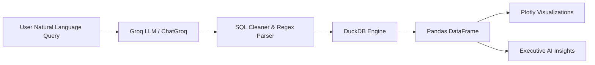

# 📊 AI Analytics Engine

🚀 **Live App:** [https://ai-analytics-agent-ecdgbeymdrmqyxszp4lulf.streamlit.app](https://ai-analytics-agent-ecdgbeymdrmqyxszp4lulf.streamlit.app)

# 📊 Conversational AI Analytics Engine

An end-to-end AI-powered data analytics assistant that translates natural language business questions into executable DuckDB SQL queries, generates real-time data visualizations, and delivers automated executive summaries.

---

## ⚡ Features
- **Natural Language to SQL:** Translates plain English business questions into valid SQL queries using Groq models.
- **Self-Healing SQL Loop:** Automatically catches and retries failed execution queries.
- **Interactive Visualizations:** Dynamically renders charts using Plotly Express based on output data structure.
- **Executive Insights:** Generates high-impact executive summaries directly from query results.

---

## 🏗️ System Architecture



---

## 🛠️ Tech Stack
- **Frontend / Framework:** Streamlit
- **Database Engine:** DuckDB
- **LLM Provider:** Groq API (Qwen / Llama / OpenAI OSS series)
- **Data & Charting:** Pandas, Plotly Express

---

## 🚀 Quickstart Guide

### 1. Clone the Repository
```bash
git clone [https://github.com/purveshvasantwagh-alt/AI-analytics-agent.git](https://github.com/purveshvasantwagh-alt/AI-analytics-agent.git)
cd AI-analytics-agent
